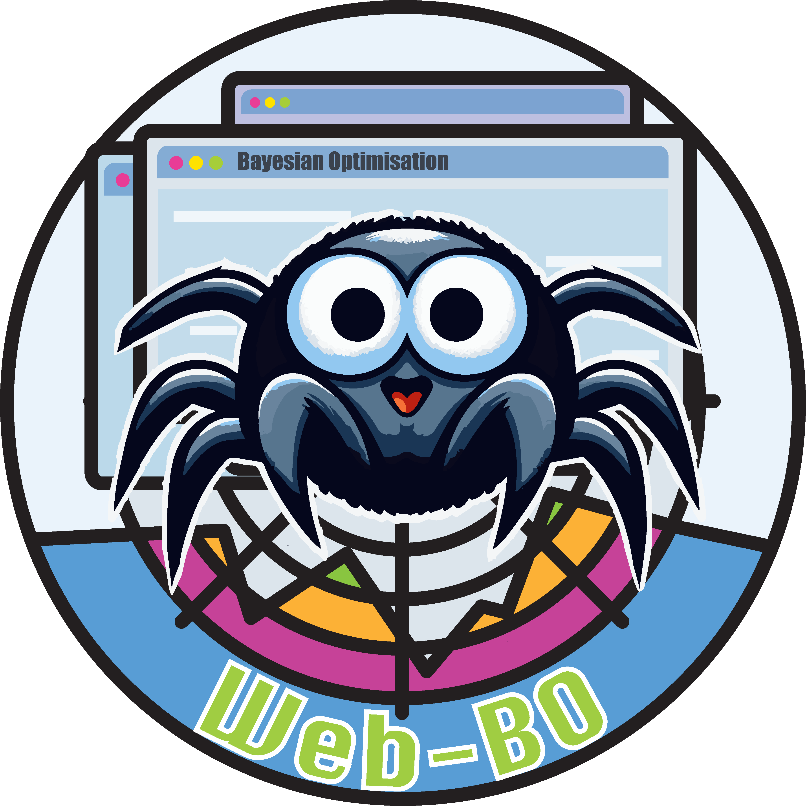

<h1 align="center">
     
    
     
    Web-BO
     
</h1>

<h4 align="center">A GUI to support data-driven optimisation for chemical tasks</h4>

    <a href="#key-features">key features</a> •
    <a href="#examples">examples</a> •
    <a href="citation">citation</a> •
    <a href="#acknowledgements">acknowledgements</a> •
    <a href="#license">license</a>

 

## key features

`Web-BO` is a web application offering a graphical user interface (GUI) to facilitate the application of BO to a wide array of chemical problems and offers several key features:
* **modular platform** that is easily integrated into existing ELN frameworks
* can be used as a **standalone database and optimiser for chemical tasks**. All of the data is stored in a searchable SQL database in an intuitive and future-proof form, enabling efficient benchmarking of varying data-driven optimisation algorithms.
* **no coding experience is necessary** to interface with and apply BO algorithms to chemical optimisation applications.
* can integrate **bespoke BO solvers**
* optimisation space **validation** to ensure seamless integration

## examples

`Web-BO` possesses 2 examples and 1 walk-through; one example demonstrates a sample optimisation task (described in the manuscript and below), one example provides sample input *csv* files, and the walk-through demonstrates the integration with <a href="https://github.com/the-grey-group/datalab">`datalab`</a>.

### optimisation task demonstration

### toy dataset demonstration

### integrating ELNs

## citation

A. M. Mroz, P. N. Toka, E. A. del Rio Chanona, K. E. Jelfs, *submitted*.

## acknowledgements
The authors thank Dr. Matthew Evans, one of the developers of <a href="https://github.com/the-grey-group/datalab">`datalab`</a> for insightful discussions and assistance in working with <a href="https://github.com/the-grey-group/datalab">`datalab`</a>'s API. The authors would also like to thank Dr. Diego Alonso Alvarez for his technical assistance in making `Web-BO` publically available. A.M.M. is supported by the Eric and Wendy Schmidt AI in Science Postdoctoral Fellowship, a Schmidt Futures program. K.E.J acknowledges the European Research Council through Agreement No. 758370 (ERC-StG-PE5-CoMMaD) and the Royal Society for a University Research Fellowship.

## license
