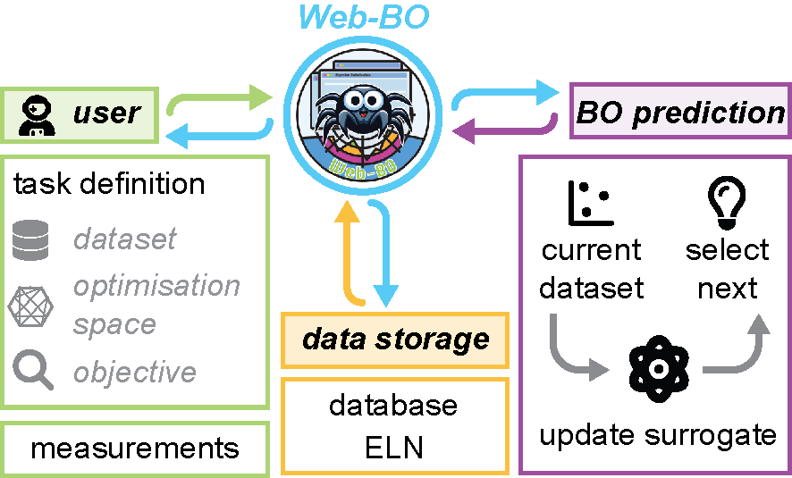
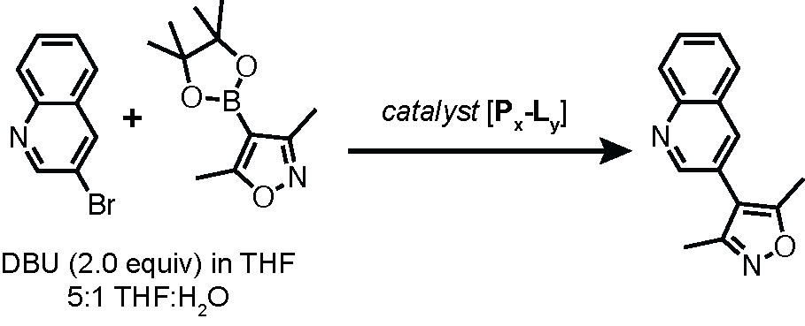
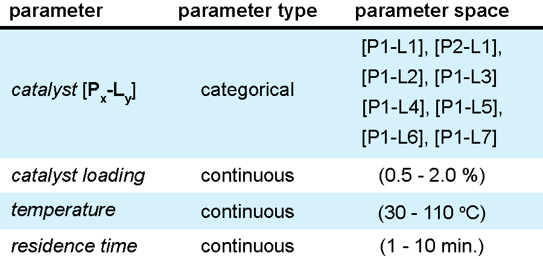
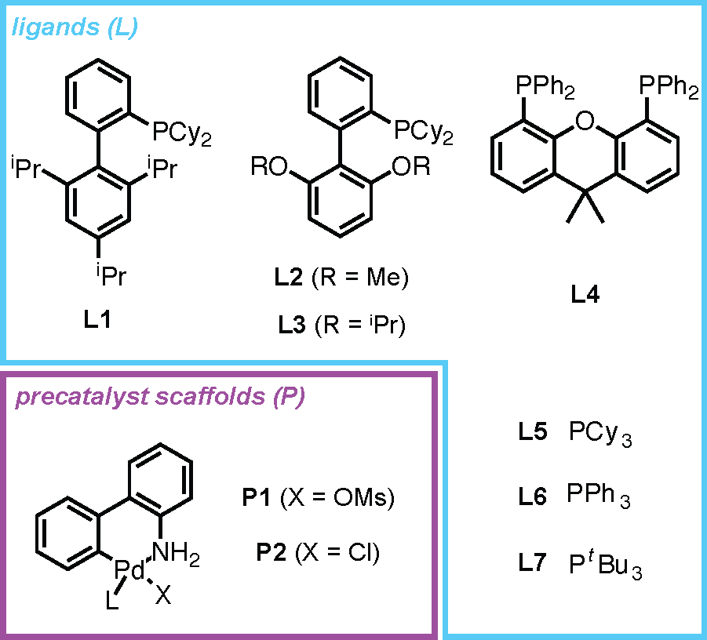

<h1 align="center">
     
    
     
    Web-BO
     
</h1>

<h4 align="center">A GUI to support data-driven optimisation for chemical tasks</h4>

    <a href="#key-features">key features</a> •
    <a href="#examples">examples</a> •
    <a href="citation">citation</a> •
    <a href="#acknowledgements">acknowledgements</a> •
    <a href="#license">license</a>

 

## key features
<table>
<tr>
<td>

<a href="https://suprashare.rcs.ic.ac.uk/web-bo/">`Web-BO`</a> is a web application offering a graphical user interface (GUI) to facilitate the application of BO to a wide array of chemical problems.

Users define the optimisation task and perform the measurements, and Web-BO takes care of the rest!

</td>
<td>

</td>
</tr>
<tr>
<td colspan="2">

`Web-BO` offers several key features:

* **modular platform** that is easily integrated into existing ELN frameworks
* can be used as a **standalone database and optimiser for chemical tasks**. All of the data is stored in a searchable SQL database in an intuitive and future-proof form, enabling efficient benchmarking of varying data-driven optimisation algorithms.
* **no coding experience is necessary** to interface with and apply BO algorithms to chemical optimisation applications.
* can integrate **bespoke BO solvers**
* optimisation space **validation** to ensure seamless integration

</td>
</tr>
</table>

## examples

`Web-BO` possesses 2 examples and 1 walk-through; one example demonstrates a sample optimisation task (described in the manuscript and below), one example provides sample input *csv* files, and the walk-through demonstrates the integration with <a href="https://github.com/the-grey-group/datalab">`datalab`</a>.

### optimisation task demonstration

To help you get familiar with all that Web-BO has to offer, we provide an optimization case study that takes advantage of existing reaction emulators to acquire the experimental measurements.

This case study concerns optimizing the coupling of 3-bromoquinoline with
3,5-dimethylisoxazole-4-boronic acid pinacol ester in the presence of
1,8-diazobicyclo[5.4.0]undec-7-ene (DBU) and THF/water, Figure 1.

<h5 align="center">

Figure 1. Suzuki-Miyaura cross-coupling reaction involved in this case study.
</h5>
The parameter space involved in this optimisation task is detailed in Figure 2.

<h5 align="center">

Figure 2. Parameter space spanned by this
case study includes 3 continuous variables (catalyst loading, temperature,
and residence time) and 1 categorical variable (catalyst).
</h5>
The catalyst options are presented in Figure 3.

<h5 align="center">

Figure 3. The catalyst options included in
this study.

</h5>

This case study takes advantage of the experiment emulators offered by the <a    zhref="https://github.com/sustainable-processes/summit" class="tooltip-test" title="Tooltip">Summit</a> package. Specifically, the <a href="https://gosummit.readthedocs.io/en/latest/experiments_benchmarks/implemented_benchmarks.html#cross-coupling-emulator-benchmarks" class="tooltip-test" title="Tooltip">Suzuki-Miyaura Cross Coupling Emulator</a>.

### toy dataset demonstration

We also offer an example of the *csv* format expected by `Web-BO`; this is in the <a href="https://github.com/austin-mroz/webBO/tree/main/toy-dataset"> `toy-datset`</a> directory. This is comprised of a <a href="https://github.com/austin-mroz/webBO/blob/main/toy-dataset/test_dataset.csv">dataset</a> and a <a href="">list of categories</a> for the categorical variable.

| solvents | temperature| pressure | target |
| :---------:  |  :-------:  | :------: | :---------: |
| a | 25 | 1.0 | 2.344 |
| b | 45 | 2.2 | 4.5555 |
| c | 25 | 2.3 | 10.333 |
| d | 55 | 2.4 | 1.3 |
| e | 10 | 2.0 | 4.5 |
| f | 75 | 1.0 | 2.455 |
| g | 65 | 1.5 | 3.0 |
| *categorical* | *integer* | *continuous* | *continuous* |

The solvents are a categorical variable. Thus, we need to define all of the options that comprise the optimisation space. This takes the general form:

| solvents |
| :------: |
| a |
| b |
| c |
| ... | 
| x |
| y |
| z |

### integrating ELNs

## citation

A. M. Mroz, P. N. Toka, E. A. del Rio Chanona, K. E. Jelfs, *submitted*.

## acknowledgements
The authors thank Dr. Matthew Evans, one of the developers of <a href="https://github.com/the-grey-group/datalab">`datalab`</a> for insightful discussions and assistance in working with <a href="https://github.com/the-grey-group/datalab">`datalab`</a>'s API. The authors would also like to thank Dr. Diego Alonso Alvarez for his technical assistance in making `Web-BO` publically available. A.M.M. is supported by the Eric and Wendy Schmidt AI in Science Postdoctoral Fellowship, a Schmidt Futures program. K.E.J acknowledges the European Research Council through Agreement No. 758370 (ERC-StG-PE5-CoMMaD) and the Royal Society for a University Research Fellowship.

## license

We release this software under the conditions of the MIT license.
